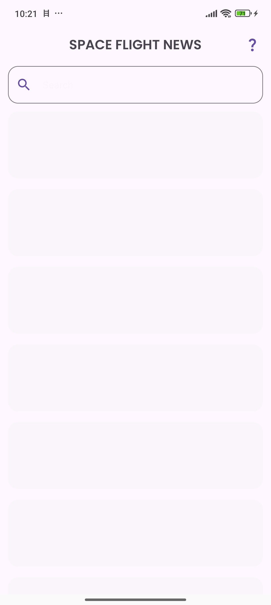
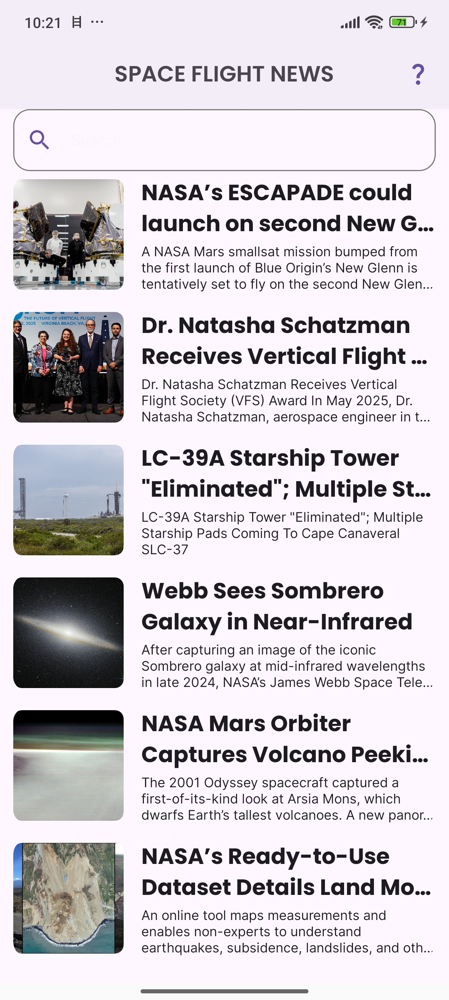
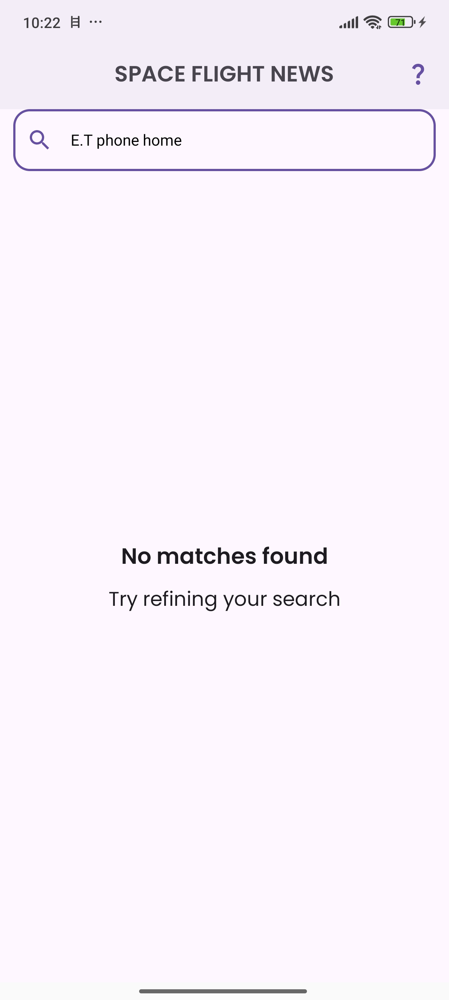
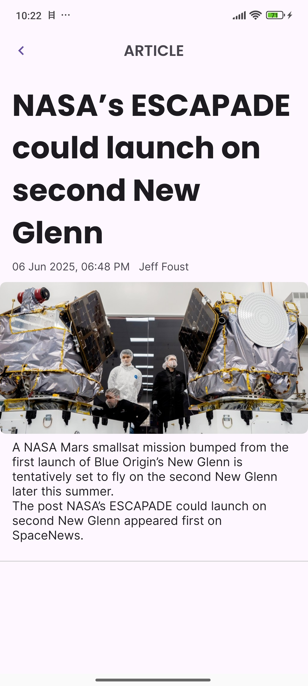
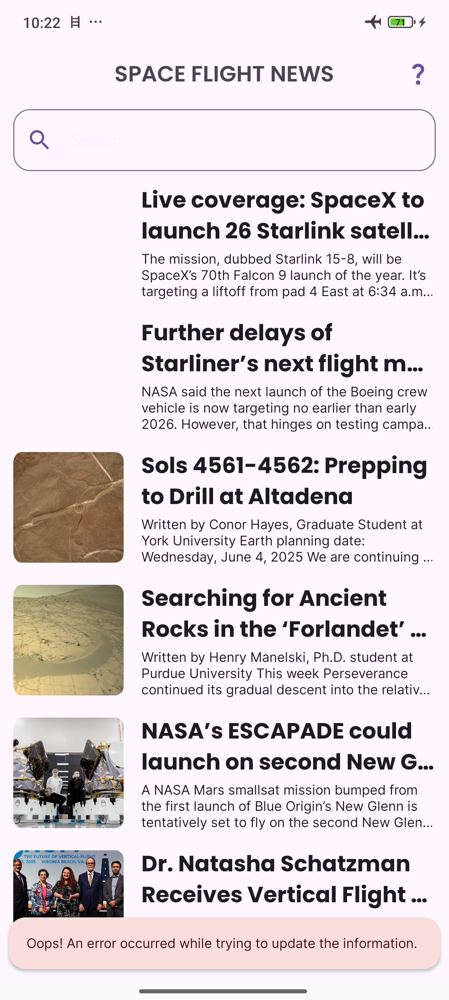
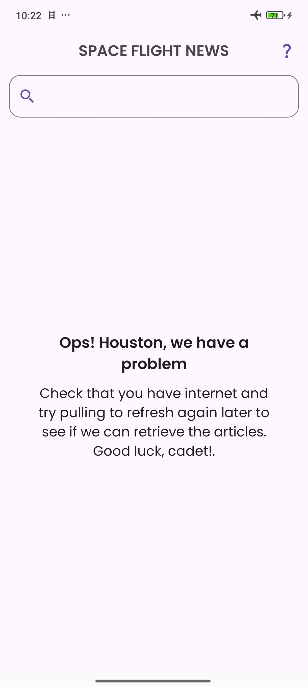

# Space Flight News App🚀 — MercadoLibre Mobile Challenge

¡Bienvenidos! Este repositorio contiene la implementación de un desafío de codificación móvil para **MercadoLibre**.

El cual consiste en construir una aplicación Android que consume la [Space Flight News API](https://api.spaceflightnewsapi.net/) para mostrar artículos sobre misiones espaciales.

> 🔥 **Contexto del desafío:**
> Un usuario debe poder **buscar**, **navegar** y **ver los detalles** de artículos de noticias relacionados con el espacio de una manera fluida e intuitiva.
>
> **Disclaimer**
> Reconozco que las herramientas empleadas en esta solución son muy
> potentes para un problema tan sencillo ; sin embargo, el objetivo aquí
> es demostrar la mi capacidad técnica y conocimientos

📘 **[Read this README in english](./README.md)**

---

##  Resumen del Desafío

Desarrollar una aplicación móvil con las siguientes pantallas y funcionalidades:

- **Pantalla de Lista de Artículos**:
  Incluye un **campo de búsqueda** y una **lista desplazable** de los artículos más recientes.

- **Funcionalidad de Búsqueda**:
  Filtra artículos dinámicamente según la entrada del usuario.

- **Pantalla de Detalles del Artículo**:
  Muestra la información completa sobre el artículo seleccionado.

- **Pull to refresh** y soporte para **rotación de dispositivo** (el estado de la pantalla debe persistir).

---

##  Enfoque Técnico

- **Arquitectura limpia** y patrones de diseño
- **Pruebas unitarias**
- **Diseño de layout óptimo**
- **Experiencia de usuario y retroalimentación**
- **Manejo de errores (para desarrolladores y usuarios)**
- **Seguridad de memoria (ej. evitar fugas)**
- **Legibilidad del código y documentación**

---

## Resumen del Proyecto

| Capa              | Tecnología                          |
|-------------------|-------------------------------------|
| Lenguaje          | 100% Kotlin                         |
| UI                | Jetpack Compose                     |
| Arquitectura      | MVI + Clean Architecture            |
| Inyección de Dependencias | Hilt                            |
| Asincronía/Reactividad | Coroutines + Flow                   |
| Pruebas           | JUnit4 + MockK                      |
| Red               | Retrofit + Kotlinx Serialization    |

---

## Un viaje de investigación y desarrollo

Si bien el equipo de desarrollo constaba de un único tripulante (su servidor), la misión se llevó a cabo con la agilidad y el ingenio necesarios para alcanzar los objetivos. Para optimizar el tiempo, adopté una **metodología hibrida pero estructurada**, adaptando las fases de un ciclo de desarrollo para un lanzamiento eficiente.

### Análisis:

El punto de partida fue la documentación de la **API de Space Flight News**. Al principio, esperaba encontrar una interfaz de usuario visualmente impresionante para inspirarme. Sin embargo, descubrí que la Spaceflight News API fue concebida principalmente como un **recurso para desarrolladores**, para ser pulida por la comunidad. Como bien lo explicó su creador, Derk de The Space Devs, en Reddit, la API surgió de una necesidad personal, no como parte de una plataforma de medios tradicional. Esta revelación me impulsó a buscar la inspiración en otras latitudes.

### Diseño:

Con los esquemas de la API en mano y la guía de la **arquitectura limpia** y los **principios SOLID**, me enfoqué en modelar los datos esenciales. La gran pregunta era: ¿cómo transformar esta información en una experiencia de usuario atractiva?  para un diseño con **auténtico "sabor a espacio"**, decidí ir directamente a la fuente. Exploré sitios web de noticias espaciales ya establecidos, como [Space.com](http://space.com/) y [NASASpaceFlight.com](http://nasaspaceflight.com/). Finalmente, la simplicidad y la claridad de **[nasa.gov/news/recently-published/](http://nasa.gov/news/recently-published/)** se convirtieron en mi musa, ofreciéndome una base sólida para una interfaz intuitiva y amigable.

### Implementación:

Con el análisis completado y una visión clara del diseño, di paso a la fase de implementación. Aunque la tentación de recurrir a herramientas de diseño avanzadas era fuerte (probar Stitch, la AI de Google que genera archivos en Figma), la premura del tiempo me llevó a confiar en lo que llamamos  **"ojo clínico"** para la estética y la usabilidad.

Actualicé Android Studio a su última versión, establecí una base de proyecto robusta y aproveche herramientas y conocimientos adquiridos en experiencias previas para optimizar el desarrollo. El proyecto fue concebido pensando en el futuro, incorporando **convention plugins** de Gradle. Esto asegura que la aplicación sea no solo funcional, sino también altamente escalable y fácil de mantener, tal como un sistema modular bien diseñado.

### Pruebas:

Dado el tamaño del proyecto, implementé **tests unitarios** en cada capa de nuestra arquitectura. Esto me permitió verificar la funcionalidad de los componentes principales, desde el dominio hasta la presentación, asegurando un rendimiento confiable y estable.

### Mantenimiento:

Respecto a la fase de mantenimiento, es un capítulo que se escribirá a medida que el proyecto evolucione.

## 📸 Screenshots

  
  
  
  
  
  
  

---

## 📄 Licencia

Licencia MIT

---