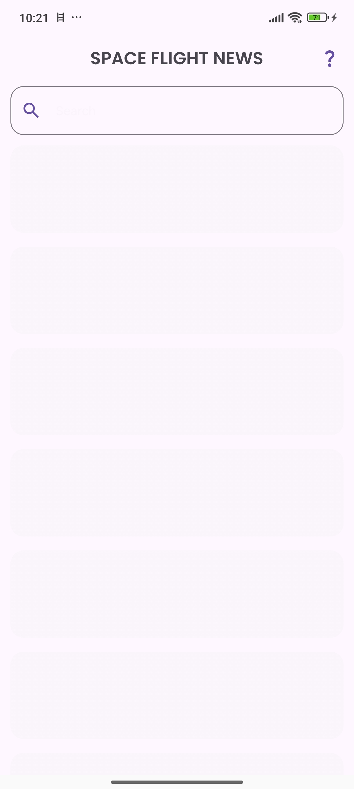
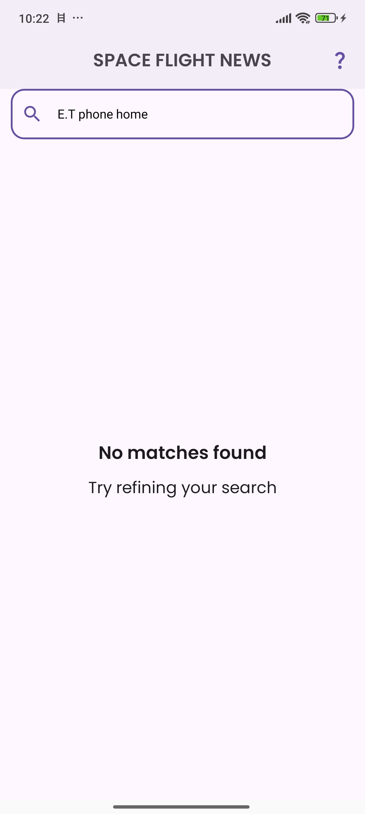
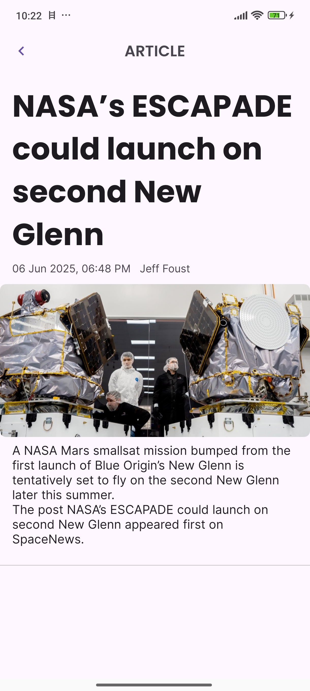

# Space Flight News App🚀 — MercadoLibre Mobile Challenge

Welcome! This repository contains the implementation of a mobile coding challenge for **MercadoLibre**.

This challenge consists of building an Android app that consumes the [Space Flight News API](https://api.spaceflightnewsapi.net/) to display articles about space missions.

> 🔥 **Challenge context:**
> A user must be able to **search**, **browse**, and **view the details** of space-related news articles in a smooth, intuitive way.
>
> **Disclaimer**
> I recognize that the tools employed in this solution are very powerful for such a simple problem; however, the objective here is to demonstrate my technical capacity and knowledge.

📘 **[Leer este README en español](./README.es.md)**

---

## Challenge Summary

Develop a mobile app with the following screens and functionalities:

- **Article List Screen**:
  Includes a **search field** and a **scrollable list** of the most recent articles.

- **Search Functionality**:
  Filters articles dynamically based on user input.

- **Article Detail Screen**:
  Shows full information about the selected article.

- **Pull to refresh** and support for **device rotation** (screen state must persist).

---

## Technical Focus

- **Clean architecture** & design patterns
- **Unit testing**
- **Optimal layout design**
- **User experience and feedback**
- **Error handling (dev + user facing)**
- **Memory safety (e.g., avoiding leaks)**
- **Code readability and documentation**

---

## Project Overview

| Layer                 | Technology                        |
|-----------------------|-----------------------------------|
| Language              | 100% Kotlin                       |
| UI                    | Jetpack Compose                   |
| Architecture          | MVI + Clean Architecture          |
| Dependency Injection  | Hilt                              |
| Async/Reactive        | Coroutines + Flow                 |
| Testing               | JUnit4 + MockK                    |
| Networking            | Retrofit + Kotlinx Serialization  |

---

## A Journey of Research and Development

While the development team consisted of a single crew member (yours truly), the mission was carried out with the agility and ingenuity necessary to achieve the objectives. To optimize time, I adopted an **hybrid yet structured methodology**, adapting the phases of a development cycle for an efficient launch.

### Analysis:

The starting point was the documentation for the **Space Flight News API**. Initially, I expected to find a visually impressive user interface to draw inspiration from. However, I discovered that the Spaceflight News API was primarily conceived as a **resource for developers**, to be polished by the community. As its creator, Derk from The Space Devs, explained on Reddit, the API emerged from a personal need, not as part of a traditional media platform. This revelation prompted me to seek inspiration elsewhere.

### Design:

With the API schemas in hand and guided by **clean architecture** and **SOLID principles**, I focused on modeling the essential data. The big question was: how to transform this information into an attractive user experience? For a design with an **authentic "taste of space,"** I decided to go directly to the source. I explored established space news websites like [Space.com](http://space.com/) and [NASASpaceFlight.com](http://nasaspaceflight.com/). Ultimately, the simplicity and clarity of **[nasa.gov/news/recently-published/](http://nasa.gov/news/recently-published/)** became my muse, offering a solid foundation for an intuitive and friendly interface.

### Implementation:

With the analysis completed and a clear design vision, I moved on to the implementation phase. Although the temptation to use advanced design tools was strong (like trying Stitch, Google's AI that generates Figma files), time constraints led me to trust what I call my **"clinical eye"** for aesthetics and usability.

I updated Android Studio to its latest version, established a robust project base, and leveraged tools and knowledge gained from previous experiences to optimize development. The project was conceived with the future in mind, incorporating **Gradle convention plugins**. This ensures the application is not only functional but also highly scalable and easy to maintain, just like a well-designed modular system.

### Testing:

Given the project's size, I implemented **unit tests** in each layer of our architecture. This allowed me to verify the functionality of the main components, from the domain to the presentation, ensuring reliable and stable performance.

### Maintenance:

Regarding the maintenance phase, it's a chapter that will be written as the project evolves.

## 📸 Screenshots

  
  
  
  
  
  
  

---

## 📄 License

MIT License

---